# REACTJS SELF LEARNING

[I. React.createElement()](#i-reactcreateelement)

[II. React-DOM](#ii-react-dom)

[III. JSX](#iii-jsx)

[IV. Props & Components](#iv-props--components)

[V. DOM Events](#v-dom-events)

[VI. Note JSX](#vi-note-jsx)

[VII. useState](#vii-usestate)

[VIII. useEffect](#viii-useeffect)

[IX. useLayoutEffect](#ix-uselayouteffect)

[X. useRef](#xi-useref)

[XI. React.memo (HOC)](#xi-reactmemo-hoc)

[XII. useCallback](#xii-usecallback)

[XIII. useMemo](#xiii-usememo)


## I. React.createElement()

Dùng để tạo ra các element trước khi render vào DOM, tương tự như `document.createElement()` nhưng có cú pháp và cách dùng như sau.

**Syntax:**

```Javascript
    const reactElement = React.createElement(
        type,
        props,
        children1,
        children2,
        ...
    );
```

**Ví dụ:**

```html
    <!-- Tạo ra element sau -->
    <ul id="demo">
        <li class="item" style="color:red;">1</li>
        <li class="item" style="color:blue;font-size:1.6rem;">2</li>
        <li>3<li>
    </ul>
```

Tạo với `React.createElement()`

```Javascript
    const list = React.createElement(
        "ul",
        {
            id: "demo",
            style: {
                backgroundColor: "blue",
                position: "absolute"
            }
        },
        React.createElement(
            "li",
            {
                class: "item",
                style: {
                    color: "red"
                }
            },
            "1"
        ),
        React.createElement(
            "li",
            {
                class: "item",
                style: {
                    color:"blue",
                    font-size:"1.6rem"
                }
            },
            "2"
        ),
        React.createElement(
            "li",
            null,
            "3"
        )
    )
```

Đối với `type` của element thì có thể nhận các dữ liệu là `string`, `function`, `class`.

Đối với kiểu `function` hoặc `class` thường được dùng để tạo ra các layout cho các element => có thể dùng lại layout với các element mà không cần viết đi viết lại các layout đó.

**Ví dụ:**

```html
    <div id="root3"></div>

    <script type="text/babel">
        function Header() {
            return (
              <div className="header">New Header</div>
            )
        }

        class Content extends React.Component {
          render() {
            return(<div className="content">Content</div>)
          }
        }

        const app = (
          <div className="wrapper">
            <Header />
            <Content />
            <div className="footer">Footer</div>
          </div>
        )

        ReactDOM.render(app, document.getElementById("root3"));
    </script>
```

Kết quả:

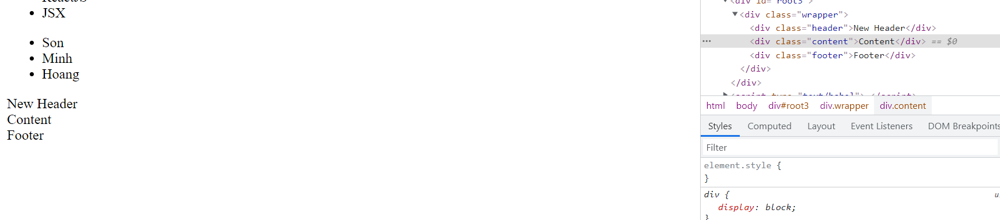

Ta chú ý khi dùng kiểu `function` thì tên `function` phải được viết hoa chữ cái đầu tiên, nếu không sẽ bị báo lỗi và không thực hiện được.

Đối với `Class` thì phải kế thừa từ `React.Compenent` và hàm đặt tên là `render`

## II. React-DOM

### 1. ReactDOM.render()

**Syntax:**

```Javascript
    ReactDOM.render(element, container, callback)
```

Ví dụ cho:

```html
    <div id="root"></div>
```

Cần render:

```html
    <div id="demo">
        <h1>Heading</h1>
        <p>Đây là đoạn văn demo</p>
    </div>
```

vào trong thẻ div, `id="root"`

```Javascript
    //Tạo  element
    const element = React.createElement(
        "div",
        {
            id:"demo"
        },
        React.createElement(,
            "h1",
            {},
            "Heading"
        ),
        React.createElement(,
            "p",
            {},
            "Đây là đoạn văn demo"
        ),
    );

    //Lấy ra container
    const container = document.getElementById("root");

    //Render
    ReactDOM.render(element, container);

```

## III. JSX

- Để render được element vào `root` thì cần truyền vào tham số `element` là ReactElement mà ReactElement thì được tạo bằng các cú pháp `React.createElement()` => rất phức tạp.

Vì vậy mà ta dùng `JSX (Javascript XML)` có cấu trúc tương tự như HTML để tạo các `ReactElement`. Việc biên dịch từ JSX ra Javascript để tạo `ReactElement` được thực thi bởi thư viện `babel` của javascript. Thư viện này sẽ biên dịch đoạn code viết bằng JSX ra Javascript thực hiện tạo element như các ví dụ ở bài trước.

Xem live demo babel chuyển đổi JSX thành Javascript ở web sau:

[babel live demo](https://babeljs.io/repl#?browsers=&build=&builtIns=false&corejs=3.6&spec=false&loose=false&code_lz=MYewdgzgLgBApgGzgWzmWBeGAeAFgRgD4AJRBEGAdRACcEATbAegMKA&debug=false&forceAllTransforms=false&shippedProposals=false&circleciRepo=&evaluate=false&fileSize=false&timeTravel=false&sourceType=module&lineWrap=true&presets=es2015%2Creact&prettier=false&targets=&version=7.15.6&externalPlugins=&assumptions=%7B%7D)

**Ví dụ:**

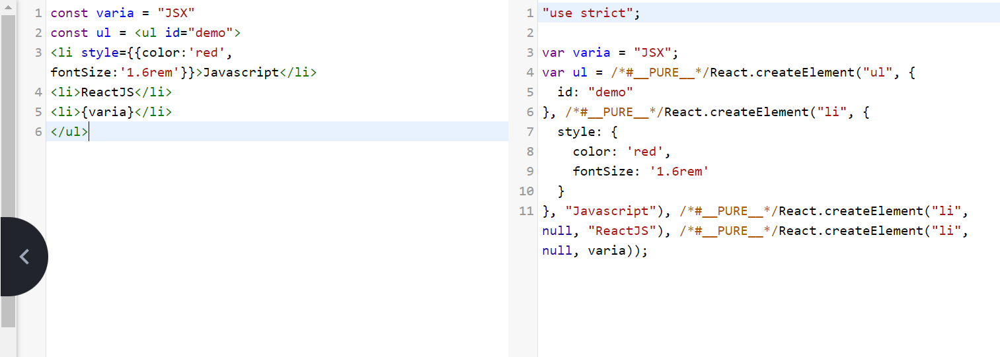

Ví dụ render mảng dữ liệu với JSX:

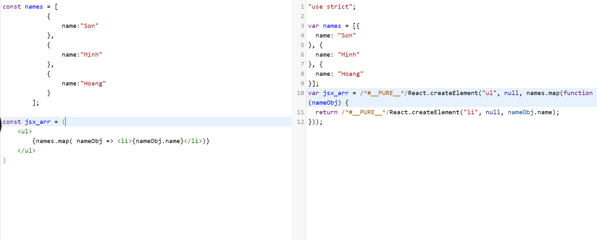

Chú ý khi với `javascript` thường, mảng names sau khi map sẽ cần phải join lại để dùng vs `innerHTML` method còn đối với `JSX` thì việc truyền vào mảng là hợp lý đối với cú pháp `React.createElement`. Xem hình ảnh sau để hiểu rõ tại sao ta không cần map mảng names khi dùng với `React` và `JSX`

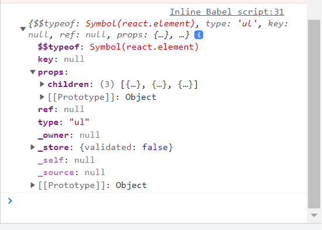

Ta thấy children của `ul` có kiểu là `Array` => hợp lý.

**Lưu ý:**

Khi ta muốn render cặp element sau:

```html
    <h1>Heading</h1>
    <p>Parapraph</p>
```

Ta không thể dùng JSX như sau:

```Javascript
    const element = (
        <h1>Heading</h1>
        <p>Paragraph</p>
    )
```

Vì đoạn code như trên sẽ có lỗi:


Vì nó sẽ được phiên dịch thành:

```Javascript
    const element = (
        React.createElement("h1",null,"Heading")
        React.createElement("p",null,"Paragraph")
    )
```

=> Không có syntax như vậy.

Nhìn vào error message ta thấy rằng, JSX element phải được wrap trong một thẻ nào đó. Như vậy đoạn code trên ta có thể sửa như sau:

```Javascript
    const element = (
        <div>
            <h1>Heading</h1>
            <p>Paragraph</p>
        </div>
    )
```

Tuy nhiên việc làm như trên sẽ làm sinh ra một thẻ `div` không mong muốn. Thay vì vậy ta có thể làm như sau:

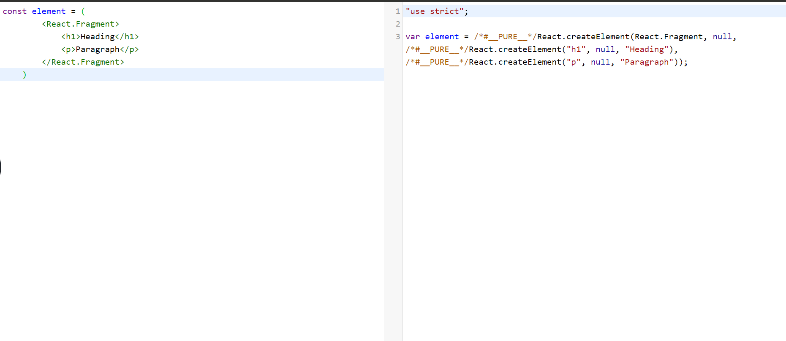

Thẻ `React.Fragment` được coi như là một container ảo cho `JSX` element mà không sinh thêm thẻ nào trong html thật.

## IV. Props & Components

- Đối với React Element, props sử dụng khi tạo hoặc khi dùng với JSX thì giống với props của HTML bình thường khi props có một từ, từ 2 từ trở lên thì dùng camel case và có các trường hợp đặc biệt là `class` => `className` và `for` => `htmlFor`.

- Đối với React Components ( tạo ra bằng `function` hoặc `class`), ở đây ta sẽ xét được tạo bởi `function`, thì các props được sử dụng như các parameters truyền vào hàm và đặt theo nguyên tắc camelCase.

**Ví dụ:**

```Javascript
 function Item() {
        return (
            <div className="item">
                <h1 className="item-title">This is heading</h1>
                <p className="item-pragraph">This is paragraph</p>
            </div>
        )
    }

    function TestComponent(props) {
        return (
            <div className="item">
                <h1 className="item-title">{props.heading}</h1>
                <p className="item-pragraph">{props.paragraph}</p>
            </div>
        )
    }
    // Dùng destructoring
    function TestDestrucCom({
        heading,
        paragraph
    }) {
        return (
            <div className="item">
                <h1 className="item-title">{heading}</h1>
                <p className="item-pragraph">{paragraph}</p>
            </div>
        )
    }
    
    function App() {
        return (
            <div id="wrapper">
                <Item/>
                <TestComponent
                    heading= "This is heading parameter"
                    paragraph = "This is paragraph parameter"
                 />
                <TestDestrucCom
                    heading= "This is heading parameter with destructoring"
                    paragraph = "This is paragraph parameter with destructoring"
                />
            </div>
        )
    }

    

    ReactDOM.render(<App/>, document.getElementById('root1'));   
```

Xem kết quả và code tại: [react_components.html](react_components.html)

**Chú ý:** Khi render element qua mảng, sẽ xuất hiện warning như sau:

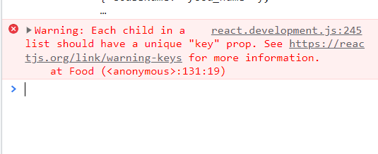

Để khắc phục lỗi này, ta có thể truyền một `prop` vào React element là `key`, các `key` của các element trong mảng phải khác nhau nên ta có thể để `key` là `index`.

**Ví dụ:**

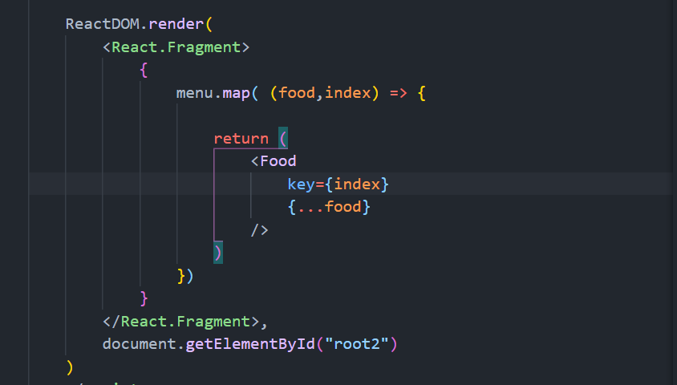

**Ví dụ về components (tiếp):**

```html
<script type="text/babel">
    const Form = {
        Input() {
            return <input style={{marginBottom: "12px"}}/>
        },
        Textarea() {
            return <textarea style={{display:"block"}}></textarea>
        }
    }

    ReactDOM.render(
        <React.Fragment>
            <Form.Input/>
            <Form.Textarea/>
        </React.Fragment>,
        document.getElementById("root3")
    )
</script>
```

## V. DOM Events

Xem ví dụ:

```html
    <div id="root">

    </div>
    <div id="root2"></div>

    <script type="text/babel">
        const myBtn = (
            <button onClick={function(){alert("ok")}}>Click me</button>
        )
        
        ReactDOM.render(myBtn, document.getElementById("root"));
    </script>
```

Chú ý event được viết dưới dạng `camelCase`

## VI. Note JSX

- code được viết trong dấu `{}` từ các ví dụ trước trong JSX nhận vào là expresssion. Ví dụ nếu trong đó có xuất hiện `if`, `else` => lỗi.
- Cụ thể:

```Javascript
    <Component
        prop1 = {literal}
        prop2 = {expression}
    />
```

- Khi truyền vào prop vào làm parmeter thì default nó sẽ mang giá trị là true.

Ta có ví dụ sau:

```html
    <script type="text/babel">
        function Compo({class,children}) {
            return <div className={class}>{children}</div>
        }

        const test = (
            <div id="wrapper">
                <Compo class="OK"><h1>Hello</h1></Compo>
            </div>
        )
    </script>
```

Ta thấy với trường hợp dùng `<Component>Data</Component>`, thì Data ở đấy chính là children theo đúng cú pháp `React.createElement`.

## VII. useState

Dùng để thay đổi dữ liệu trong Component. Sử dụng trong function component.

**Ví dụ:**

```Javascript
import {useState} from 'react'

function App() {
    const [counter, setCounter] = useState(1);

    const handleIncreasing = () => {
        setCounter(counter + 1);
    }

    return (
        <div className="App" style={{padding: 20}}>
            <h1>{counter}</h1>
            <button onClick={handleIncreasing}>Increase</button>
        </div>
    );
}

export default App;
```

**Kết quả:**


Kết quả nhận được là mỗi lần ấn vào button sẽ tăng số đếm lên 1.

Như vậy ta có syntax:

```Javascript
[state, setState] = useState(initialState);
```

Trong đó:

- `initialState` là giá trị ban đầu của dữ liệu. Nếu truyền vào parameter là 1 hàm thì `initialState` là giá trị trả về của hàm chứ không phải hàm.

- `setState` sẽ là hàm để xử lý thay đổi dữ liệu của `state` với giá trị ban đầu của `state` là `initialState`. Như vậy `setState` là thay thế `state` bằng giá trị mới.

Nếu như ta truyền vào `setState` là một callback. Cùng với ví dụ bên trên, ta xét :

```Javascript
const handleIncreasing = () => {
    setCounter(counter + 1);
    setCounter(counter + 1);
    setCounter(counter + 1);
}
```

Nếu như sử dụng hàm `handleIncreasing` như trên thì kết quả khi ấn nút `Increase` không thay đổi bởi vì khi gọi `setCounter(counter +1)` thì React sẽ gọi lại hàm component là `App` và khi đó `counter = counter +1`. Tức là với giá trị ban đầu của `counter = 1` ta sẽ nhận được:

```Javascript
const handleIncreasing = () => {
    setCounter(2);
    setCounter(2);
    setCounter(2);
}
```

=> 3 hàm là như nhau, React sẽ chỉ gọi 1 lần. Trong trường hợp này, nếu muốn code hoạt động đúng là khi click button ta được số cộng thêm 3. ta sử dụng:

```Javascript
const handleIncreasing = () => {
    setCounter( preCounter => preCounter + 1);
    setCounter( preCounter => preCounter + 1);
    setCounter( preCounter => preCounter + 1);
}
```

Trong đó `preCounter` là giá trị trước đó của state.

**Một số ví dụ của sử dụng useState, thay thế code ở function App() trong file [App.js](./my-react-app/src/App.js) bằng các đoạn code trong file sau:**

- [useState_example_1](./example/useState_example_1.js)
- [useState_example_2](./example/useState_example_2.js)
- [useState_example_3](./example/useState_example_3.js)
- [useState_example_4](./example/useState_example_4.js)

## VIII. useEffect()

Dùng trong trường hợp thay đổi các side effect.

Ví dụ:

- Update DOM
- Call API
- Listen DOM Events:
  - Scroll
  - resize window
- Timer function

**Syntax:**

```Javascript
import {useEffect} from 'react'

useEffect(callback);
useEffect(callback, []);
useEffect(callback, [deps]);
```

- Ứng với mỗi cách truyền parameter vào `useEffect()` thì `callback` đều được gọi mỗi khi `Component` được mounted vào DOM.
- `callback` trong `useEffect` chỉ được thực hiện khi component đã được thêm vào DOM.

**Đối với các cách truyền tham số:**

Cách dùng   |  chức năng
------------|------------
useEffect(callback)| `callback` được gọi mỗi khi component được re-render
useEffect(callback, [])| `callback` được gọi đúng một lần đầu tiên khi component được mounted
useEffect(callback, [deps])| `callback` sẽ được gọi mỗi khi `deps` thay đổi.

Xem các ví dụ:

- [useEffect_example_1](./example/useEffect_example_1.js)
- [useEffect_example_2](./example/useEffect_example_2.js)

**Lưu ý với cleaning up function dùng trong useEffect:**

- `Clean up function` luôn được gọi trước khi component được unmounted.
- `clean up function` được gọi trước khi callback được gọi( trừ lần mounted) -> trường hợp này thường được sử dụng đối với `useEffect(callback, [deps])`.

## IX. useLayoutEffect()

`useLayoutEffect()` cũng dùng để thực hiện các side effect như `useEffect()`. Thông thường `useEffect()` được sử dụng nhiều hơn vì `useLayoutEffect()` khá giống với `useEffect()`.

So sánh:

Các bước thực hiện trong DOM

`useLayoutEffect()` | `useEffect()`
--------------------|--------------
1.Cập nhật lại state|1.Cập nhật lại state
2.Cập nhật DOM (mutated)|2.Cập nhật DOM (mutated)
3.Gọi cleanup function nếu deps thay đổi(sync)|3.Render lại UI
4.Gọi callback(sync)|4.Gọi cleanup function nếu deps thay đổi(sync)|3.Render lại UI
5.Render lại UI|5.Gọi callback(sync)

## X. useRef

- `useRef` hook cho phép ta sử dụng các biến trong Component như 1 biến có phạm vi toàn cục, nghĩa là biến sẽ giữ nguyên khi Component re-render.

Ví dụ:

```Javascript
import {useState} from 'react'

function App() {
    const [count, setCount] = useState(0);

    let my_count = 0;

    const handleCount = () => {
        my_count +=1;
        setCount(pre => pre +1);
    }
    console.log("my_count: ",my_count);

    return (
        <>
            <h1>{count}</h1>
            <button onClick={handleCount}>Click me</button>
        </>
    )
}
```

Ở ví dụ trên, khi Click vào button, hàm `handleCount` được gọi và tăng giá trị của biến `my_count` lên 1 đồng thời gọi `useState` nên Component sẽ được render lại. Ta có kết quả:

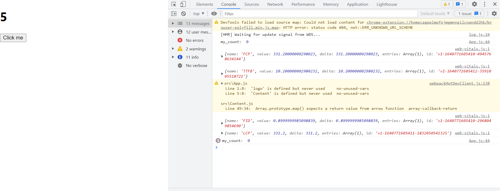

Ta thấy biến `my_count` sẽ được set lại liên tục mỗi khi Component được gọi vì nó có phạm vi cục bộ, chỉ tồn tại trong Component( vì Component chính là function).

Ta có thể giải quyết bằng cách dùng `useRef()` hook thay vì đưa `my_count` ra làm biến toàn cục.

```Javascript
import {useState, useRef} from 'react'

function App() {
    const [count, setCount] = useState(0);

    const my_count = useRef(0);

    const handleCount = () => {
        my_count.current +=1;
        setCount(pre => pre +1);
    }
    console.log("my_count: ",my_count.current);

    return (
        <>
            <h1>{count}</h1>
            <button onClick={handleCount}>Click me</button>
        </>
    )
}
```

Kết quả:

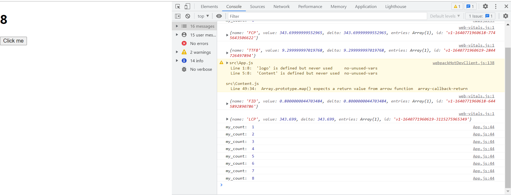

Như vậy `useRef` có syntax:

```Javascript
const ref = useRef(initialValue);
```

Trong đó initialValue là giá trị khởi tạo khi Component được mounted. `useRef(initialValue)` sẽ trả về object.

Đoạn code trên sẽ có kết quả như sau:

```Javascript
ref = {
    current: initialValue
}
```

Như vậy ta có thể truy cập vào giá trị mà ta muốn dùng bằng cách sử dụng `ref.current`.

- Một cách dùng khác của `useRef` đó là truy cập và lưu trữ trực tiếp element trong DOM.
- Trong React, ta có thể thêm `ref` attribute cho element, sử dụng nó với `useRef` để truy cập nó trực tiếp trong DOM.

**Ví dụ:**

```Javascript
import {useRef} from 'react'

function App() {
  const inputElement = useRef();

  const focusInput = () => {
    inputElement.current.focus();
  };

  return (
    <>
      <input type="text" ref={inputElement} />
      <button onClick={focusInput}>Focus Input</button>
    </>
  );
}
```

Ví dụ trên, biến `inputElement` dùng để truy cập trực tiếp đến `input` element.

- Cuối cùng ta sẽ nói đến cách dùng `useRef` để keep track với giá trị trước khi `setState` của `useState`.

**Ví dụ:**

```Javascript
import { useState, useEffect, useRef } from "react";

function App() {
  const [inputValue, setInputValue] = useState("");
  const previousInputValue = useRef("");

  useEffect(() => {
    previousInputValue.current = inputValue;
  }, [inputValue]);

  return (
    <>
      <input
        type="text"
        value={inputValue}
        onChange={(e) => setInputValue(e.target.value)}
      />
      <h2>Current Value: {inputValue}</h2>
      <h2>Previous Value: {previousInputValue.current}</h2>
    </>
  );
}
```

Lý giải: Khi Component được mounted ra thì callback của `useEffect` được gọi nên:

```Javascript
previousInputValue.current = inputValue;
```

Sau đó khi ta gõ vào ô input, ví dụ gõ kí tự `a` thì `onChange` event sẽ gọi đến `setInputValue('a')`. Như vậy Component được `setState` nên sẽ được render lại, khi đó `inputValue = 'a'` do nhận được từ `setInputValue('a')`.

Khi `inputValue` thay đổi đồng nghĩa với với việc `useEffect` sẽ được gọi và có thứ tự thực hiện như sau:

1. `inputValue` thay đổi
2. Cập nhật lại DOM.
3. Render lại UI, lúc này do `callback` của `useEffect` chủa được gọi nên `previousInputValue.current` vẫn mang giá trị trước đó của `inputValue` là `''`. Vì vậy mà hiển thị ra màn hình sẽ là giá trị trước đó của `inputValue` và giá trị hiện tại của `inputValue`.
4. Gọi cleanup function nếu có
5. Gọi `callback` của `useEffect`, lúc này thì `previousInputValue.current` mới được cập nhật lên là giá trị hiện tại của `inputValue` và khi ta click button thì quá trình từ 1 đến 5 lại được lặp lại.

## XI. React.memo (HOC)

Xét ví dụ sau:

Trong file `Content.js`

```Javascript
function Content() {
    console.log('re-render');
    return (
        <h1>This is children component</h1>
    );
}

export default Content;

```

Trong file `App.js`

```Javascript
import {useState} from 'react'
import Content from './Content.js'

function App() {
    const [count, setCount] = useState(0);

    return (
        <>
            <Content/>
            <h1>{count}</h1>
            <button onClick={() => setCount(count + 1)}>Click me</button>
        </>
    )
}
```

Ta thấy khi click button thì state của `App` thay đổi dẫn đến việc `App` Component re-render đồng thời làm cho `Content` component bị re-render theo mặc dù state của `Content` component không đổi.

Để khắc phục việc này (giúp tăng performance) thì ta có thể dùng `memo` của react bằng cách.

Trong file `Content.js`

```Javascript
import {memo} from 'react'

function Content() {
    // Code goes here
}

export default memo(Content)
```

Nếu không destructuring `memo` từ `react` ra thì có thể dùng `React.memo()`.

Như vậy, `Content` component sẽ không bị re-render theo Component cha là `App` component nếu như không có state nào của nó bị thay đổi.

Nếu như có state nào của `Content` bị thay đổi thì nó vẫn re-render bình thường.

## XII. useCallback

Xét ví dụ như khi dùng `memo` nhưng thay đổi như sau:

Trong file `Content.js`

```Javascript
import {memo} from 'react'

function Content({increasing}) {
    console.log('re-render');
    return (
        <>
            <h1>This is children component</h1>
            <button onClick = {increasing}>Click me</button>
        </>
    );
}

export default Content;
```

Trong file `App.js`

```Javascript
import {useState} from 'react'
import Content from './Content.js'

function App() {
    const [count, setCount] = useState(0);

    const increasing = () => {
        setCount(pre => pre +1);
    }

    return (
        <>
            <h1>{count}</h1>
            <Content increasing = {increasing}/>
        </>
    )
}
```

Kết quả:

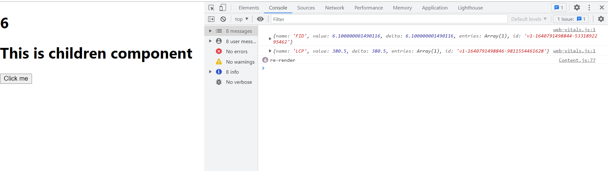

Như ta thấy mặc dù đã dùng memo và không có properties nào của `Content` component bị thay đổi thế nhưng nó lại vẫn bị re-render.

Thực tế thì vẫn có một property của `Content` bị thay đổi đó chính là hàm `increasing`. Lý do khi `App` component thay đổi state, nó sẽ re-render và hàm `increasing` của nó để truyền vào `Content` component cũng sẽ bị re-declared ( thay đổi tham chiếu) mặc dù nội dung của nó không đổi. Vì vậy nên `Content` component vẫn bị re-render.

Để khắc phục việc này, cải thiện performance thì ta có thể dùng `useCallback` hook

**Syntax:**

```Javascript
useCallback(callback, [deps]);
```

đối với ví dụ trên ta sử dụng như sau trong file `App.js`

```Javascript
import {useState, useCallback} from 'react'
import Content from './Content.js'

function App() {
    const [count, setCount] = useState(0);

    const increasing = useCallback(() => {
        setCount( pre => pre +1);
    },[]);

    return (
        <>
            <h1>{count}</h1>
            <Content increasing = {increasing}/>
        </>
    )
}
```

Bây giờ thì `Content` component sẽ chỉ thay đổi nếu như props nào đó của nó thay đổi.

**Chú ý:**

- Việc sử dụng `useCallback` thường được dùng với `memo` để khắc phục những việc mà `memo` chưa làm được như ví dụ trên là sự thay đổi tham chiếu hàm.

## XIII. useMemo

`useMemo` hook khá giống `useCallback`. Khác nhau ở điểm là `useCallback` thì trả về một `memoized function` còn `useMemo` thì trả về một `memoized value` nào đó.

Xét ví dụ:

```Javascript
import {useState} from 'react'

function App() {
    const [productName, setProductName] = useState('');
    const [productPrice, setProductPrice] = useState('');
    const [listProducts, setListProducts] = useState([]);

    const handleAddProduct = () => {
        setListProducts( pre => [...pre, {
            name: productName,
            price: Number(productPrice)
        }]);
        setProductName('');
        setProductPrice('');
    }

    const total = listProducts.reduce((sum, product) => {
        console.log('Tính toán tại');
        return sum + product.price;
    },0)

    return (
        <>
            <input
                value={productName}
                placeholder="Nhập vào tên sản phẩm"
                onChange = {e => setProductName(e.target.value)}
            />
            <input
                value={productPrice}
                placeholder="Nhập vào giá sản phẩm"
                onChange = {e => setProductPrice(e.target.value)}
            />
            <button onClick={handleAddProduct}>Thêm sản phẩm</button>
            <h2>Total: {total}</h2>
            <ul>
                {listProducts.map((product, index) => {
                    return (
                        <li key={index}>{product.name} - {product.price}</li>
                    )
                })}
            </ul>
        </>
    )
}
```

Kết quả:

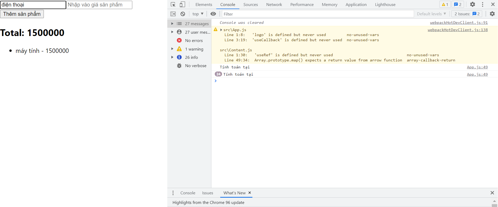

Ta thấy, sau khi thêm một sản phẩm vào list. Khi ta thực hiện nhập sản phẩm tiếp theo thì `'Tính toán lại'` liên tục được gọi ra. Lý do khi ta nhập input `onChange` event sẽ được gọi làm thay đổi state của component dẫn đến việc component bị re-render.

Mỗi lần re-render, nó sẽ gọi lại một lần `listProducts.reduce(...)`, Chính vì thế mà nó in ra `'Tính toán lại'` mặc dù sản phẩm mới chưa được thêm vào. Để rõ hơn ta có thể đặt một dòng log trong component để thấy.

Để giải quyết vấn đề tính toán lại không cần thiết này, ta dùng `useMemo` hook.

`useMemo` sẽ giúp cho giá trị không cần tính toán lại nếu như không có `[deps]` nào của nó bị thay đổi.

**Syntax:**

```Javascript
import {useMemo} from 'react'

useMemo(callback, [deps]);
```

Ta dùng với ví dụ trên như sau. Thay đoạn code sau

```Javascript
const total = listProducts.reduce((sum, product) => {
    console.log('Tính toán tại');
    return sum + product.price;
},0)
```

thành dùng với `useMemo`

```Javascript
import {useMemo, useState} from 'react'

function App() {
    //...

    const total = useMemo(()=> {

        const result = listProducts.reduce((sum, product) => {
            console.log('Tính toán lại');
            return sum + product.price;
        },0);

        return result;
    },[listProducts])
}
```

Kết quả:

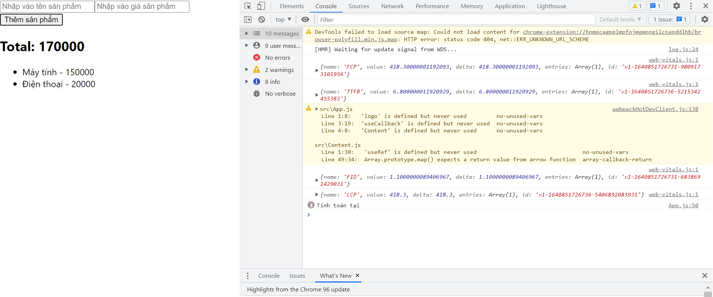

Như vậy chỉ khi nào `[deps]` là `listProducts` thay đổi thì total mới được tính toán lại.

Ta thấy màn hình hiện ra 3 lần `'Tính toán lại` là do `console` được đặt trong reduce, nên mỗi lần duyệt qua một phần tử mảng nó sẽ in ra một lần.