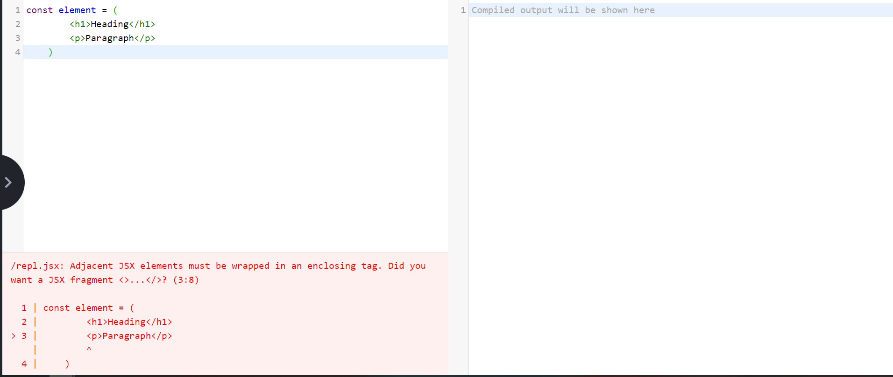

# REACTJS SELF LEARNING

## I. React.createElement()

Dùng để tạo ra các element trước khi render vào DOM, tương tự như `document.createElement()` nhưng có cú pháp và cách dùng như sau.

**Syntax:**

```Javascript
    const reactElement = React.createElement(
        type,
        props,
        children1,
        children2,
        ...
    );
```

**Ví dụ:**

```html
    <!-- Tạo ra element sau -->
    <ul id="demo">
        <li class="item" style="color:red;">1</li>
        <li class="item" style="color:blue;font-size:1.6rem;">2</li>
        <li>3<li>
    </ul>
```

Tạo với `React.createElement()`

```Javascript
    const list = React.createElement(
        "ul",
        {
            id: "demo",
            style: {
                backgroundColor: "blue",
                position: "absolute"
            }
        },
        React.createElement(
            "li",
            {
                class: "item",
                style: {
                    color: "red"
                }
            },
            "1"
        ),
        React.createElement(
            "li",
            {
                class: "item",
                style: {
                    color:"blue",
                    font-size:"1.6rem"
                }
            },
            "2"
        ),
        React.createElement(
            "li",
            null,
            "3"
        )
    )
```

Đối với `type` của element thì có thể nhận các dữ liệu là `string`, `function`, `class`.

Đối với kiểu `function` hoặc `class` thường được dùng để tạo ra các layout cho các element => có thể dùng lại layout với các element mà không cần viết đi viết lại các layout đó.

**Ví dụ:**

```html
    <div id="root3"></div>

    <script type="text/babel">
        function Header() {
            return (
              <div className="header">New Header</div>
            )
        }

        class Content extends React.Component {
          render() {
            return(<div className="content">Content</div>)
          }
        }

        const app = (
          <div className="wrapper">
            <Header />
            <Content />
            <div className="footer">Footer</div>
          </div>
        )

        ReactDOM.render(app, document.getElementById("root3"));
    </script>
```

Kết quả:


Ta chú ý khi dùng kiểu `function` thì tên `function` phải được viết hoa chữ cái đầu tiên, nếu không sẽ bị báo lỗi và không thực hiện được.

Đối với `Class` thì phải kế thừa từ `React.Compenent` và hàm đặt tên là `render`

## II. React-DOM

### 1. ReactDOM.render()

**Syntax:**

```Javascript
    ReactDOM.render(element, container, callback)
```

Ví dụ cho:

```html
    <div id="root"></div>
```

Cần render:

```html
    <div id="demo">
        <h1>Heading</h1>
        <p>Đây là đoạn văn demo</p>
    </div>
```

vào trong thẻ div, `id="root"`

```Javascript
    //Tạo  element
    const element = React.createElement(
        "div",
        {
            id:"demo"
        },
        React.createElement(,
            "h1",
            {},
            "Heading"
        ),
        React.createElement(,
            "p",
            {},
            "Đây là đoạn văn demo"
        ),
    );

    //Lấy ra container
    const container = document.getElementById("root");

    //Render
    ReactDOM.render(element, container);

```

## III. JSX

- Để render được element vào `root` thì cần truyền vào tham số `element` là ReactElement mà ReactElement thì được tạo bằng các cú pháp `React.createElement()` => rất phức tạp.

Vì vậy mà ta dùng `JSX (Javascript XML)` có cấu trúc tương tự như HTML để tạo các `ReactElement`. Việc biên dịch từ JSX ra Javascript để tạo `ReactElement` được thực thi bởi thư viện `babel` của javascript. Thư viện này sẽ biên dịch đoạn code viết bằng JSX ra Javascript thực hiện tạo element như các ví dụ ở bài trước.

Xem live demo babel chuyển đổi JSX thành Javascript ở web sau:

[babel live demo](https://babeljs.io/repl#?browsers=&build=&builtIns=false&corejs=3.6&spec=false&loose=false&code_lz=MYewdgzgLgBApgGzgWzmWBeGAeAFgRgD4AJRBEGAdRACcEATbAegMKA&debug=false&forceAllTransforms=false&shippedProposals=false&circleciRepo=&evaluate=false&fileSize=false&timeTravel=false&sourceType=module&lineWrap=true&presets=es2015%2Creact&prettier=false&targets=&version=7.15.6&externalPlugins=&assumptions=%7B%7D)

**Ví dụ:**


Ví dụ render mảng dữ liệu với JSX:


Chú ý khi với `javascript` thường, mảng names sau khi map sẽ cần phải join lại để dùng vs `innerHTML` method còn đối với `JSX` thì việc truyền vào mảng là hợp lý đối với cú pháp `React.createElement`. Xem hình ảnh sau để hiểu rõ tại sao ta không cần map mảng names khi dùng với `React` và `JSX`


Ta thấy children của `ul` có kiểu là `Array` => hợp lý.

**Lưu ý:**

Khi ta muốn render cặp element sau:

```html
    <h1>Heading</h1>
    <p>Parapraph</p>
```

Ta không thể dùng JSX như sau:

```Javascript
    const element = (
        <h1>Heading</h1>
        <p>Paragraph</p>
    )
```

Vì đoạn code như trên sẽ có lỗi:



Vì nó sẽ được phiên dịch thành:

```Javascript
    const element = (
        React.createElement("h1",null,"Heading")
        React.createElement("p",null,"Paragraph")
    )
```

=> Không có syntax như vậy.

Nhìn vào error message ta thấy rằng, JSX element phải được wrap trong một thẻ nào đó. Như vậy đoạn code trên ta có thể sửa như sau:

```Javascript
    const element = (
        <div>
            <h1>Heading</h1>
            <p>Paragraph</p>
        </div>
    )
```

Tuy nhiên việc làm như trên sẽ làm sinh ra một thẻ `div` không mong muốn. Thay vì vậy ta có thể làm như sau:


Thẻ `React.Fragment` được coi như là một container ảo cho `JSX` element mà không sinh thêm thẻ nào trong html thật.

## IV. Props & Components

- Đối với React Element, props sử dụng khi tạo hoặc khi dùng với JSX thì giống với props của HTML bình thường khi props có một từ, từ 2 từ trở lên thì dùng camel case và có các trường hợp đặc biệt là `class` => `className` và `for` => `htmlFor`.

- Đối với React Components ( tạo ra bằng `function` hoặc `class`), ở đây ta sẽ xét được tạo bởi `function`, thì các props được sử dụng như các parameters truyền vào hàm và đặt theo nguyên tắc camelCase.

**Ví dụ:**

```Javascript
 function Item() {
        return (
            <div className="item">
                <h1 className="item-title">This is heading</h1>
                <p className="item-pragraph">This is paragraph</p>
            </div>
        )
    }

    function TestComponent(props) {
        return (
            <div className="item">
                <h1 className="item-title">{props.heading}</h1>
                <p className="item-pragraph">{props.paragraph}</p>
            </div>
        )
    }
    // Dùng destructoring
    function TestDestrucCom({
        heading,
        paragraph
    }) {
        return (
            <div className="item">
                <h1 className="item-title">{heading}</h1>
                <p className="item-pragraph">{paragraph}</p>
            </div>
        )
    }
    
    function App() {
        return (
            <div id="wrapper">
                <Item/>
                <TestComponent
                    heading= "This is heading parameter"
                    paragraph = "This is paragraph parameter"
                 />
                <TestDestrucCom
                    heading= "This is heading parameter with destructoring"
                    paragraph = "This is paragraph parameter with destructoring"
                />
            </div>
        )
    }

    

    ReactDOM.render(<App/>, document.getElementById('root1'));   
```

Xem kết quả và code tại: [react_components.html](react_components.html)

**Chú ý:** Khi render element qua mảng, sẽ xuất hiện warning như sau:


Để khắc phục lỗi này, ta có thể truyền một `prop` vào React element là `key`, các `key` của các element trong mảng phải khác nhau nên ta có thể để `key` là `index`.

**Ví dụ:**


**Ví dụ về components (tiếp):**

```html
<script type="text/babel">
    const Form = {
        Input() {
            return <input style={{marginBottom: "12px"}}/>
        },
        Textarea() {
            return <textarea style={{display:"block"}}></textarea>
        }
    }

    ReactDOM.render(
        <React.Fragment>
            <Form.Input/>
            <Form.Textarea/>
        </React.Fragment>,
        document.getElementById("root3")
    )
</script>
```

## V. DOM Events

Xem ví dụ:

```html
    <div id="root">

    </div>
    <div id="root2"></div>

    <script type="text/babel">
        const myBtn = (
            <button onClick={function(){alert("ok")}}>Click me</button>
        )
        
        ReactDOM.render(myBtn, document.getElementById("root"));
    </script>
```

Chú ý event được viết dưới dạng `camelCase`

## VI. Các lưu ý trong JSX

- code được viết trong dấu `{}` từ các ví dụ trước trong JSX nhận vào là expresssion. Ví dụ nếu trong đó có xuất hiện `if`, `else` => lỗi.
- Cụ thể:

```Javascript
    <Component
        prop1 = {literal}
        prop2 = {expression}
    />
```

- Khi truyền vào prop vào làm parmeter thì default nó sẽ mang giá trị là true.

Ta có ví dụ sau:

```html
    <script type="text/babel">
        function Compo({class,children}) {
            return <div className={class}>{children}</div>
        }

        const test = (
            <div id="wrapper">
                <Compo class="OK"><h1>Hello</h1></Compo>
            </div>
        )
    </script>
```

Ta thấy với trường hợp dùng `<Component>Data</Component>`, thì Data ở đấy chính là children theo đúng cú pháp `React.createElement`.